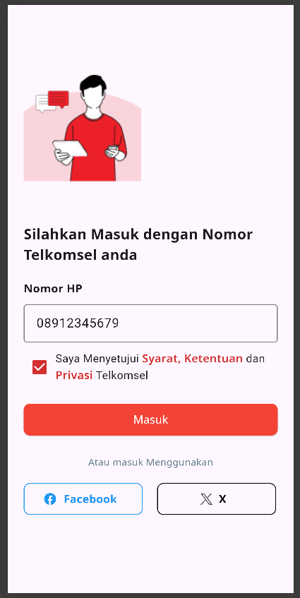
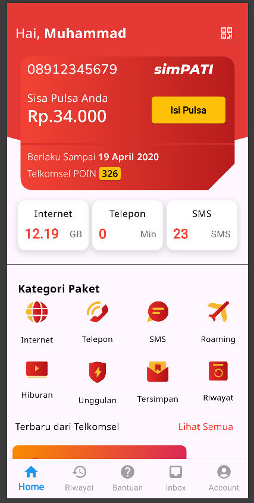
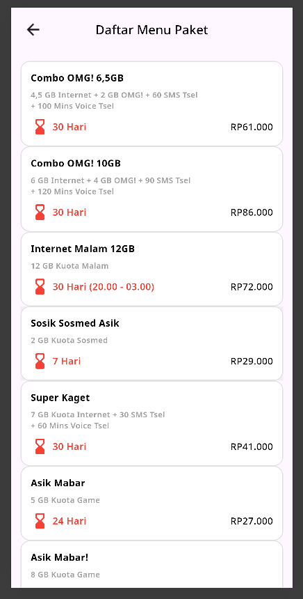
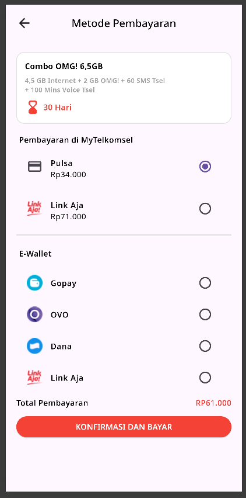

# 📱 MyTelkomsel Prototype (Jasta)

**Jasta** (UUK Project) adalah sebuah aplikasi *prototype* berbasis Flutter yang mengimitasi antarmuka dan fungsionalitas utama aplikasi telekomunikasi populer, MyTelkomsel. Proyek ini fokus pada pengembangan UI/UX yang responsif dan alur pengguna yang kompleks dalam ekosistem layanan seluler.

---

## ✨ Fitur Utama

- **🏠 Dashboard Interaktif**: Tampilan sisa pulsa, kuota data, dan masa aktif dengan gaya visual MyTelkomsel yang ikonik.
- **📦 Katalog Paket**: Telusuri berbagai pilihan paket internet, telepon, dan SMS (Daftar Paket).
- **💳 Sistem Pembayaran**: Simulasi alur pembayaran paket yang terintegrasi dengan berbagai metode pembayaran.
- **📝 Registrasi Pengguna**: Alur pendaftaran nomor kartu perdana baru.
- **🏗️ Tahap Pengembangan**: Modul khusus untuk melacak kemajuan fitur-fitur yang masih dalam pengembangan.
- **🎨 Custom UI Components**: Penggunaan *CustomClipper* untuk desain AppBar yang melengkung dan elegan.

---

## 🛠️ Tech Stack

- **Framework**: [Flutter](https://flutter.dev)
- **Language**: [Dart](https://dart.dev)
- **Design Pattern**: Prototype UI (Jasta Variant)
- **Key Widgets**: CustomClipper, BottomNavigationBar, ListViews, and Complex Grid Layouts.

---

## 📸 Screenshots

| Home Perdana | Daftar Paket | Payment Page |
|:---:|:---:|:---:|
| *Coming Soon* | *Coming Soon* | *Coming Soon* |

---

## 🚀 Getting Started

Follow these steps to run the project locally:

1. **Clone the repository**:
   ```bash
   git clone <repository-url>
   ```

2. **Navigate to the project directory**:
   ```bash
   cd uuk
   ```

3. **Install dependencies**:
   ```bash
   flutter pub get
   ```

4. **Run the application**:
   ```bash
   flutter run
   ```

---

## 📁 Project Structure

```text
lib/
├── pages/          # UI Screens (Home, Package List, Payment, Register)
├── widgets/        # Custom UI components (clipper, bottom nav)
└── main.dart       # App entrance
```

---

## 🤝 Kontribusi

Ini adalah proyek pembelajaran prototype. Jika Anda memiliki ide untuk meningkatkan kemiripan UI dengan aplikasi aslinya, silakan buat *pull request*.

---

## 📝 License

Distributed under the MIT License.

## Screenshots

<div align="center">
  <table style="border: none;">
    <tr>
      <td align="center">
        <br />
        <sub><b>Register Screen</b></sub>
      </td>
      <td align="center">
        <br />
        <sub><b>Home Screen</b></sub>
      </td>
      <td align="center">
        <br />
        <sub><b>Paket Menu Screen</b></sub>
      </td>
    </tr>
    <tr>
      <td align="center">
        <br />
        <sub><b>Search</b></sub>
      </td>
    </tr>
  </table>
</div>
